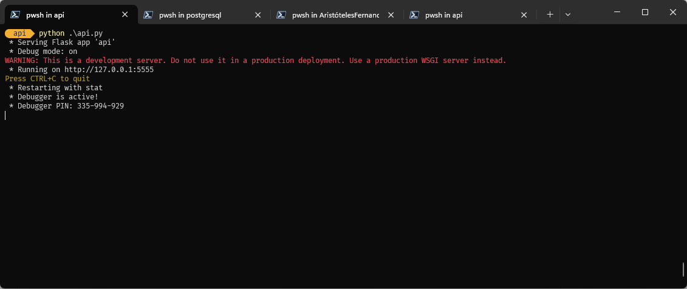
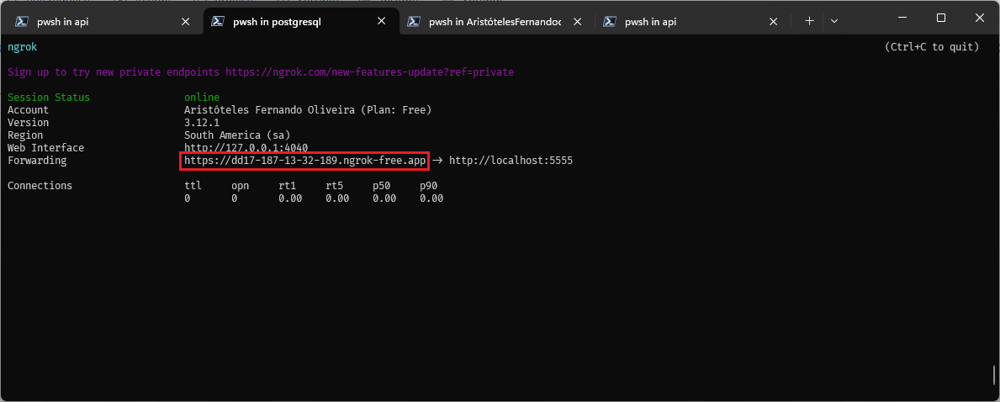

# Prova de conceito sobre como enviar dados de um banco de dados para um endpoint de API através de uma requisição POST
_Funcionará com qualquer outro verbo HTTP_

O objetivo deste repositório e dos arquivos e informações contidos neste repositório é permitir a criação de um ambiente de teste onde se comprova a possibilidade do envido de dados de uma SGBD para um endpoint de uma API.


### Requisitos para execução desta "POC"

1. Banco de dados Postgresql 16 (foi feito em lab com essa versãa)
2. computador com Linux instalado (debian ou ubuntu)
   1. VM com Postgresql instalado e configurado para acesso externo 
   2. container com POSTGRESQL (latest) com as mesmas configurações
3. Criação de usuário com permissão para criação dos objetos e execução dos scripts ou o usuário POSTGRES ter permissão para conexão remota ao postgresql.
4. Postgresql configurado para aceitar conexões externas 
5. Instalar os packages necessários:
   1. python3-full 
   2. python3-pip
   3. python3-httplib2
   4. postgresql-contrib
   5. postgresql-plpython3-16

## Preparando ambiente para execução
### Obtenha acesso ao shell da VM
Execute os comandos na sequência:

1. Atualize repositórios do Linux:
   
    ```sh
    sudo apt update
    ```

2. Instale os pacotes na sequência:
   
    ```sh
    apt install python3-full
    apt install python3-pip
    apt install python3-httplib2
    apt install postgresql-contrib
    apt install postgresql-plpython3-16
    ```

#### NOTA: caso precise ajustar o Postgresql para conexão externa:

_No arquivo PG_HBA.CONF insira a linha abaixo no final do arquivo:_

```
host    all             all             0.0.0.0/0               md5
```

_No arquivo POSTGRESQL.CONF procure a sessão do arquivo, de acordo com o comentário e insira após os comentários_
```
#------------------------------------------------------------------------------
# CONNECTIONS AND AUTHENTICATION
#------------------------------------------------------------------------------

# - Connection Settings -

listen_addresses = '*'
```


### Caso opte por usar um container para o banco de dados
Segue abaixo os arquivos **Dockerfile** e **docker-compose.yaml** necessários para buildar a magem do container.

> Dockerfile
```docker
FROM postgres

RUN apt-get update && apt-get install -y \
    python3-full \
    python3-pip \
    python3-httplib2 \
    postgresql-contrib \
    postgresql-plpython3-16 \
    procps \
    nano

ENV POSTGRES_PASSWORD=afo@030571

EXPOSE 5432
```
> docker-compose.yaml
```docker
version: '3.1'

services:
  db:
    build: .
    restart: always
    environment:
      POSTGRES_PASSWORD: afo@030571
    ports:
      - "5432:5432"
    volumes:
      - ./data:/var/lib/postgresql/data

```

Não esqueça de executar o arquivo composer para levantar o container do banco:

```sh
docker-compose up -d
```

### Execute uma ferramenta de gerenciamento de banco (pgadmin, dbeaver, etc...)

Existem scripts auxiliares que devem ser usados para criar uma tabela e popular a tabela criada com dados fake para gerar as consutas de teste. então abra a ferramenta de preferência e conecte-se a instância do banco em execução dentro da VM ou container.


## Criando a estrutura de dados para teste (opcional)
_É opcional, já que você pode usar a sua própria base de dados._

> Crie um banco de dados na instância do PostgreSQL ou use o script a seguir:

```sql
-- Database: agenda_db

-- DROP DATABASE IF EXISTS agenda_db;

CREATE DATABASE agenda_db
    WITH
    OWNER = postgres
    ENCODING = 'UTF8'
    LC_COLLATE = 'en_US.utf8'
    LC_CTYPE = 'en_US.utf8'
    LOCALE_PROVIDER = 'libc'
    TABLESPACE = pg_default
    CONNECTION LIMIT = -1
    IS_TEMPLATE = False;
```

> criação de tabela.sql

```sql
-- DROP TABLE IF EXISTS public.people;

CREATE TABLE IF NOT EXISTS public.people
(
    name character varying(250) COLLATE pg_catalog."default",
    email character varying(250) COLLATE pg_catalog."default",
    mobile character varying(25) COLLATE pg_catalog."default",
    country_name character varying(100) COLLATE pg_catalog."default",
    id SERIAL NOT NULL DEFAULT,
    CONSTRAINT people_pkey PRIMARY KEY (id)
) TABLESPACE pg_default;

ALTER TABLE IF EXISTS public.people
    OWNER to postgres;
```


> população da tabela para testes.sql

```sql
INSERT INTO public.people (name, email, mobile, country_name) VALUES ('Alice Silva', 'alice.silva@example.com', '555-1234', 'Brasil');
INSERT INTO public.people (name, email, mobile, country_name) VALUES ('Bruno Costa', 'bruno.costa@example.com', '555-5678', 'Portugal');
INSERT INTO public.people (name, email, mobile, country_name) VALUES ('Carla Mendes', 'carla.mendes@example.com', '555-8765', 'Angola');
INSERT INTO public.people (name, email, mobile, country_name) VALUES ('Daniel Souza', 'daniel.souza@example.com', '555-4321', 'Moçambique');
INSERT INTO public.people (name, email, mobile, country_name) VALUES ('Elena Rocha', 'elena.rocha@example.com', '555-6789', 'Brasil');
INSERT INTO public.people (name, email, mobile, country_name) VALUES ('Felipe Lima', 'felipe.lima@example.com', '555-9876', 'Portugal');
INSERT INTO public.people (name, email, mobile, country_name) VALUES ('Gabriela Alves', 'gabriela.alves@example.com', '555-5432', 'Angola');
INSERT INTO public.people (name, email, mobile, country_name) VALUES ('Henrique Pereira', 'henrique.pereira@example.com', '555-2109', 'Moçambique');
INSERT INTO public.people (name, email, mobile, country_name) VALUES ('Isabela Martins', 'isabela.martins@example.com', '555-6543', 'Brasil');
INSERT INTO public.people (name, email, mobile, country_name) VALUES ('João Fernandes', 'joao.fernandes@example.com', '555-3210', 'Portugal');
INSERT INTO public.people (name, email, mobile, country_name) VALUES ('Karina Oliveira', 'karina.oliveira@example.com', '555-7890', 'Angola');
INSERT INTO public.people (name, email, mobile, country_name) VALUES ('Lucas Ribeiro', 'lucas.ribeiro@example.com', '555-0987', 'Moçambique');
INSERT INTO public.people (name, email, mobile, country_name) VALUES ('Mariana Santos', 'mariana.santos@example.com', '555-7654', 'Brasil');
INSERT INTO public.people (name, email, mobile, country_name) VALUES ('Nicolas Gomes', 'nicolas.gomes@example.com', '555-4321', 'Portugal');
INSERT INTO public.people (name, email, mobile, country_name) VALUES ('Olivia Lima', 'olivia.lima@example.com', '555-1098', 'Angola');
INSERT INTO public.people (name, email, mobile, country_name) VALUES ('Pedro Almeida', 'pedro.almeida@example.com', '555-8765', 'Moçambique');
INSERT INTO public.people (name, email, mobile, country_name) VALUES ('Quintino Silva', 'quintino.silva@example.com', '555-5432', 'Brasil');
INSERT INTO public.people (name, email, mobile, country_name) VALUES ('Rafaela Costa', 'rafaela.costa@example.com', '555-2109', 'Portugal');
INSERT INTO public.people (name, email, mobile, country_name) VALUES ('Samuel Mendes', 'samuel.mendes@example.com', '555-6543', 'Angola');
INSERT INTO public.people (name, email, mobile, country_name) VALUES ('Tatiana Souza', 'tatiana.souza@example.com', '555-3210', 'Moçambique');
INSERT INTO public.people (name, email, mobile, country_name) VALUES ('Ursula Rocha', 'ursula.rocha@example.com', '555-7890', 'Brasil');
INSERT INTO public.people (name, email, mobile, country_name) VALUES ('Victor Lima', 'victor.lima@example.com', '555-0987', 'Portugal');
INSERT INTO public.people (name, email, mobile, country_name) VALUES ('Wesley Alves', 'wesley.alves@example.com', '555-7654', 'Angola');
INSERT INTO public.people (name, email, mobile, country_name) VALUES ('Xavier Pereira', 'xavier.pereira@example.com', '555-4321', 'Moçambique');
INSERT INTO public.people (name, email, mobile, country_name) VALUES ('Yara Martins', 'yara.martins@example.com', '555-1098', 'Brasil');
INSERT INTO public.people (name, email, mobile, country_name) VALUES ('Zeca Fernandes', 'zeca.fernandes@example.com', '555-8765', 'Portugal');
INSERT INTO public.people (name, email, mobile, country_name) VALUES ('Ana Oliveira', 'ana.oliveira@example.com', '555-5432', 'Angola');
INSERT INTO public.people (name, email, mobile, country_name) VALUES ('Beto Ribeiro', 'beto.ribeiro@example.com', '555-2109', 'Moçambique');
INSERT INTO public.people (name, email, mobile, country_name) VALUES ('Clara Santos', 'clara.santos@example.com', '555-6543', 'Brasil');
INSERT INTO public.people (name, email, mobile, country_name) VALUES ('Diego Gomes', 'diego.gomes@example.com', '555-3210', 'Portugal');
```

## Criando objetos no PostgreSQL

Na listagem abaixo temos os objetos que foram criados para permitir a execução das chamadas de API dentro do PostgreSQL via functions. Os comandos devem ser executados no console do banco ou em uma ferramenta administrativa da sua escolha. É inprescindível para o funcionamento, que os comandos a seguir sejam executados no banco de dados de onde os dados serão obtidos.

1. Crie a extensão para a linguagem Python dentro do postgresql:

```sql
CREATE EXTENSION IF NOT EXISTS plpython3u;
```

2. Crie a function no banco que vai enviar os dados via request 

```sql
CREATE OR REPLACE FUNCTION send_post_request()
RETURNS void AS $$
import httplib2
import json

cursor = plpy.execute("SELECT * FROM public.people")

json_data = json.dumps([dict(row) for row in cursor])

url = ' https://1c9f-187-13-32-189.ngrok-free.app/post_request'

headers = {'Content-type': 'application/json'}
http = httplib2.Http()

response, content = http.request(url, 'POST', headers=headers, body=json_data)

if response.status != 200:
    plpy.error('Erro ao enviar a requisição POST: ' + response.reason)
$$ LANGUAGE plpython3u;
```

**Obeserve a seguinte linha: _url = ' https://1c9f-187-13-32-189.ngrok-free.app/post_request'_. Aqui é configurado o endereço da api que vai receber a request post enviada pela function. como se pode ver a URI é provida via NGROK, então caso se queira testar localmente, se você não tiver uma API pronta pra teste sugiro instalar e configurar o NGROK pela sua facilidade de uso.**

3. Executando a function:
```sql
SELECT send_post_request();
```

Acompanhe na sua API o recebimento dos dados oriundos do banco de dados.

A execução da funcionalidade acima é bastante simplificada, mas podemos também tornar as coisas mais sofisticadas, fazendo, por exemplo que seja feito um POST para a API a cada insert novo na tabela com os dados que foram inseridos.

Dessa forma vamos criar uma nova function e também uma trigger para executar a function quando ocorrer um enevto de inserção de um novo registro na tabela.

**Nova function:**
```sql
CREATE OR REPLACE FUNCTION send_post_request()
RETURNS void AS $$
import httplib2
import json

cursor = plpy.execute("SELECT * FROM public.people")

json_data = json.dumps([dict(row) for row in cursor])

url = ' https://1c9f-187-13-32-189.ngrok-free.app/post_request'

headers = {'Content-type': 'application/json'}
http = httplib2.Http()

response, content = http.request(url, 'POST', headers=headers, body=json_data)

if response.status != 200:
    plpy.error('Erro ao enviar a requisição POST: ' + response.reason)
$$ LANGUAGE plpython3u;
```

**Trigger:**
```sql
CREATE TRIGGER after_insert_people
AFTER INSERT ON public.people
FOR EACH ROW
EXECUTE FUNCTION send_post_request_trigger();
```

Após a criação destes novos objetos, qualquer linha que for inserida na tabela será automáticamente enviada ao endpoint da API em execução.

## Tópico Extra: API de teste

Caso se esteja fazndo um laboratório e não se tenha uma API disponível para testes, foi incluído no repositório na pasta __API__ um pequeno programa que sobre uma api na porta 5555 e é executado localmente. Novamente recomendamos o uso do NGROK para exposição da API ao bando de dados já que o container ou a VM dificilmente conseguirão acessar o endereço _http://localhost:555_.

> Para execução da API é necessário ter instalado localmente o Python versão >= 3.10

Para execução da API, siga os passos abaixo:

1. Abra um console shell (windows já que o lab original foi desenvolvido em Windows), acesse a pasta da API e execute o seguinte comando para ativar o virtual enviroment do python:
```sh
.\venv\Scripts\activate
```

2. Execute o script da API:

```sh
python .\api.py
```
Se tudo ocorreu corretamente você verá uma saida semelhante a esta:

_Qualquer erro apresentado na execução provavelmente vai exigir conhecimento de Python, gerenciamento de packages e criação/utilização de ambientes virtuais, o que não é o escopo deste manual._

3. Execute o NGROK (préviamente instalado e configuradoconfigurado):
```sh
ngrok http http://localhost:5555
```
Novamente se tudo ocorreu de forma correta você vai visualizar o shell com esta aparência:


**ATENÇÃO: Para que tudo funcione da forma esperada, deve-se copiar a URL exibida pelo NGROK (quadrado em vermelho) e substitua no valor da variável _url_ em todas as funções que foram criadas.**

O ambiente está pronto e configurado para testes.

Para download, configuração e como usar o NGROK acesse [aqui](https://ngrok.com/download).

O reposiório possui todos os arquivos necessários para execução do laboratório.